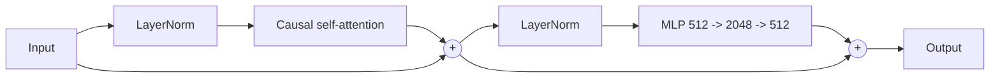
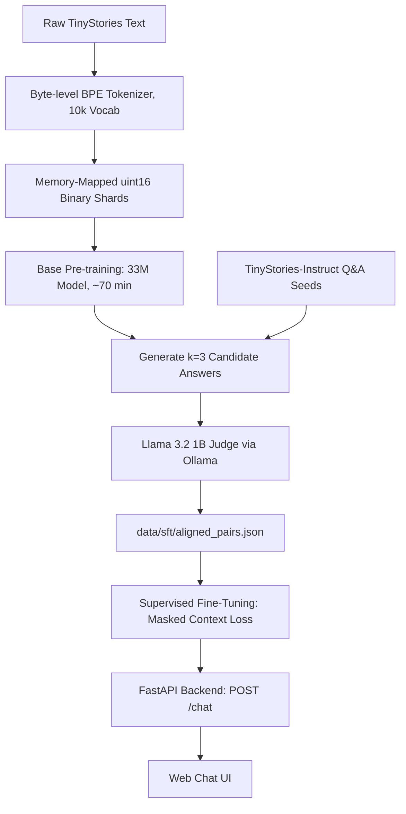
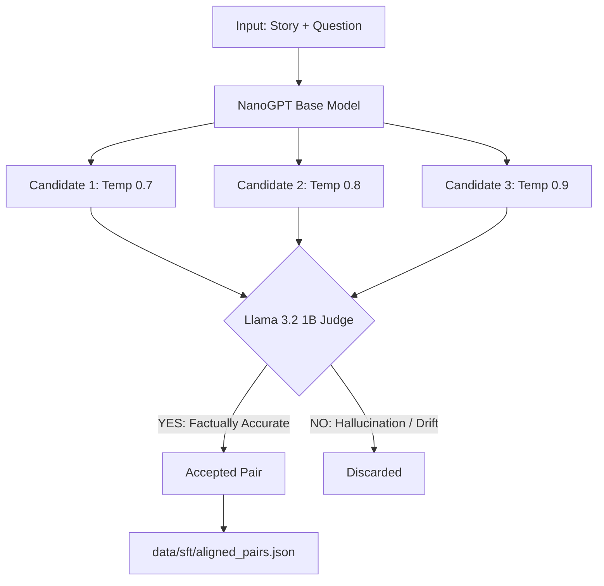

# NanoGPT: From Scratch to Aligned Story Q&A

A complete, offline LLM pipeline in PyTorch: custom BPE tokenizer, causal Transformer decoder, rejection-sampling alignment with a local Llama judge, supervised fine-tuning, and a FastAPI chat UI. Built to train and run on a **6 GB VRAM** GPU (tested on an NVIDIA GeForce RTX 4050).


> **Goal:** build small, understand everything, run locally.

---

## Contents

* [Overview](#overview)
* [Results](#results)
* [Architecture](#architecture)
* [Pipeline](#pipeline)
* [Project Structure](#project-structure)
* [Quick Start](#quick-start)
  * [Prerequisites](#prerequisites)
  * [Setup](#setup)
  * [`requirements.txt`](#requirementstxt)
* [Training Guide](#training-guide)
  * [0. Download Data](#0-download-data)
  * [1. Train the Tokenizer](#1-train-the-tokenizer)
  * [2. Base Pre-training](#2-base-pre-training)
  * [3. Rejection Sampling](#3-rejection-sampling)
  * [4. Supervised Fine-tuning](#4-supervised-fine-tuning)
  * [5. Launch the UI](#5-launch-the-ui)
* [Alignment: Rejection Sampling](#alignment-rejection-sampling)
* [Prompt Format](#prompt-format)
* [API Reference](#api-reference)
  * [`POST /chat`](#post-chat)
  * [`GET /health`](#get-health)
* [Hardware and Memory Budget](#hardware-and-memory-budget)
* [Testing](#testing)
* [Troubleshooting](#troubleshooting)
* [Limitations](#limitations)
* [Roadmap](#roadmap)
* [License](#license)

---

# Overview

|  |  |
| :--- | :--- |
| **Task** | Answer factual questions about short children's stories |
| **Data** | [TinyStories](https://huggingface.co/datasets/roneneldan/TinyStories) for pre-training, TinyStories-Instruct for Q&A seeds |
| **Model** | Dual model setup: ~15M-parameter and ~33M-parameter decoder-only Transformers |
| **Context window** | 256 tokens (15M model) / 512 tokens (33M model) |
| **Alignment** | Best-of-k rejection sampling judged by Llama 3.2 1B (Ollama) |
| **Serving** | FastAPI backend with a plain HTML/CSS/JS front end |
| **Offline** | Fully local execution, zero third-party API dependencies |

---

# Results

Benchmarked on an **NVIDIA GeForce RTX 4050 Laptop GPU (6 GB VRAM, 95 W TGP)**:

| Metric | 15M model (256 ctx) | 33M model (512 ctx) | After SFT (target) |
| :--- | :---: | :---: | :---: |
| Validation loss | `1.7958` | `1.4819` | `< 1.25` |
| Perplexity ($e^{\text{loss}}$) | `6.02` | `4.40` | `~3.50` |
| Training time | ~10.2 min (1 epoch) | ~70 min (4 epochs) | ~15-30 min |
| VRAM utilization | 1.1 GB | 1.8 GB | ~1.6 GB |
| Tokens / step | 16,384 | 32,768 | 8,192 |
| Inference latency | ~18 ms | ~28 ms | ~28 ms |

Reproduce with:

```bash
python -m nanogpt.evaluate --checkpoint checkpoints/sft_model_final.pt
```

---

# Architecture

| Hyperparameter | 15M model | 33M model | Notes |
| :--- | :---: | :---: | :--- |
| Layers | 6 | 8 | Pre-norm decoder blocks |
| Attention heads | 6 | 8 | Head dim fixed at 64 (512 / 8) |
| Hidden size ($d_{\text{model}}$) | 384 | 512 | Residual stream width |
| MLP intermediate | 1,536 | 2,048 | 4x expansion with GELU activation |
| Context window | 256 | 512 | Tokens per sequence |
| Vocabulary size | 10,000 | 10,000 | Byte-level BPE |
| Precision | bfloat16 | bfloat16 | Native Ampere / Ada Lovelace tensor cores |
| Attention kernel | SDPA | SDPA | `F.scaled_dot_product_attention` (FlashAttention) |
| Weight tying | Yes | Yes | Token embedding matrix shared with LM head |

## Parameter Breakdown (33M Architecture)

| Component | Calculation | Parameters |
| :--- | :--- | ---: |
| Token embeddings | 10,000 × 512 (tied with LM head) | 5.12M |
| Position embeddings | 512 × 512 | 0.26M |
| Self-attention | 8 layers × [4 × (512 × 512)] | 8.39M |
| Feed-forward (MLP) | 8 layers × [2 × (512 × 2,048)] | 16.78M |
| LayerNorms & biases | (8 × 2 + 1) × 512 × 2 | ~0.02M |
| **Total parameters** | | **~30.57M** |

## Decoder Block



---

# Pipeline

Every stage runs locally, without external cloud dependencies.



| Stage | Command / Script | Output | Approx. time (RTX 4050) |
| :--- | :--- | :--- | :--- |
| 1. Tokenizer | `nanogpt.tokenizers` | `tokenizer.json`, `.bin` shards | ~2 min |
| 2. Pre-training | `nanogpt.train_base` | `checkpoints/base_model_33M.pt` | ~70 min (4 epochs) |
| 3. Rejection sampling | `nanogpt.judge` | `data/sft/aligned_pairs.json` | ~20-40 min (Ollama) |
| 4. SFT | `nanogpt.train_sft` | `checkpoints/sft_model_final.pt` | ~15-30 min |
| 5. Inference server | `uvicorn app.main:app` | Web chat at `:8000` | instant |

---

# Project Structure

```text
nanogpt/
├── configs/
│   ├── base.yaml               # Architecture + pre-training hyperparameters
│   └── sft.yaml                # Supervised fine-tuning hyperparameters
│
├── scripts/
│   ├── download_data.py        # Stream and save TinyStories & Instruct datasets
│   └── run_all.sh              # Bash orchestration pipeline
│
├── src/nanogpt/                # Core modular package
│   ├── __init__.py
│   ├── config.py               # Strict dataclass configuration loader
│   ├── tokenizers.py           # Stream-chunked BPE training and binary encoding
│   ├── dataset.py              # Memmap zero-copy loader & SFT prompt masking
│   ├── model.py                # FlashAttention-backed causal Transformer
│   ├── train_base.py           # Mixed-precision BF16 pre-training loop
│   ├── generate.py             # Top-k, top-p, and temperature sampling logic
│   ├── judge.py                # Ollama-based rejection sampler (Llama 3.2 1B)
│   ├── train_sft.py            # Answer-only masked loss fine-tuning
│   └── evaluate.py             # Validation loss, perplexity, and Q&A metrics
│
├── app/
│   ├── main.py                 # FastAPI application routes
│   ├── schemas.py              # Request and response validation
│   ├── inference.py            # Checkpoint loader and generation wrapper
│   └── static/                 # Plain HTML5, CSS3, and JavaScript UI
│
├── tests/
│   ├── test_model.py           # Output tensor shapes, causality, and tied weights
│   ├── test_tokenizer.py       # Encode/decode round-tripping and special tokens
│   └── test_masking.py         # Confirms context tokens are masked with -100
│
├── data/                       # (ignored by git)
│   ├── raw/
│   ├── tokenized/
│   └── sft/
│
├── checkpoints/                # (ignored by git)
├── Makefile                    # Target shortcuts: setup, tokenize, train, judge, sft, serve
├── pyproject.toml
├── requirements.txt
└── README.md
```

## Why This Layout?

* **Package under `src/`** so scripts share code via imports and run as `python -m nanogpt.<module>`, with no path hacks.
* **Configs in YAML** instead of long CLI flags, so every run is reproducible and diffable.
* **`app/` separated from training code** so the server only imports `model.py` and `generate.py`.
* **`data/` and `checkpoints/` are git-ignored**, which keeps the repo small.

---

# Quick Start

## Prerequisites

* Python 3.10+
* NVIDIA GPU with Ampere or Ada Lovelace architecture supporting bfloat16 (e.g. RTX 3050+, RTX 4050+)
* [Ollama](https://ollama.com) installed and on your system path

## Setup

```bash
git clone https://github.com/yogeshsikhwal77/nanogpt.git
cd nanogpt

python -m venv .venv
# Linux / macOS:
source .venv/bin/activate
# Windows PowerShell:
.venv\Scripts\Activate.ps1

# PyTorch with CUDA 12.1
pip install torch --index-url https://download.pytorch.org/whl/cu121

# Project dependencies and editable install
pip install -r requirements.txt
pip install -e .

# Pull the judge model locally
ollama pull llama3.2:1b
```

Verify GPU visibility and hardware compatibility:

```bash
python -c "import torch; print('CUDA Available:', torch.cuda.is_available(), '| Device:', torch.cuda.get_device_name(0), '| BF16 Supported:', torch.cuda.is_bf16_supported())"
```

## `requirements.txt`

```text
torch>=2.1.0
numpy>=1.24.0
tokenizers>=0.15.0
pyyaml>=6.0
fastapi>=0.109.0
uvicorn[standard]>=0.27.0
requests>=2.31.0
tqdm>=4.66.0
pytest>=8.0.0
```

---

# Training Guide

Execute using `make` commands or direct module calls.

## 0. Download Data

```bash
python scripts/download_data.py
```

## 1. Train the Tokenizer

Trains a custom byte-level BPE tokenizer (10,000 vocab) and memory-maps the data into raw `uint16` binary files:

```bash
python -m nanogpt.tokenizers train --vocab-size 10000 --data-path data/raw/
python -m nanogpt.tokenizers encode --input-dir data/raw/ --output-dir data/tokenized/
```

## 2. Base Pre-training

```bash
python -m nanogpt.train_base --config configs/base.yaml
```

`configs/base.yaml`:

```yaml
model:
  dim: 512
  layers: 8
  heads: 8
  context_len: 512
  vocab_size: 10000

train:
  batch_size: 16
  grad_accum: 4         # effective batch = 64 sequences (32,768 tokens/step)
  lr: 8.0e-4
  epochs: 4
  seed: 42
  data_dir: data/tokenized/
  save_path: checkpoints/base_model_33M.pt
```

## 3. Rejection Sampling

Generate candidate answers with the base model and filter them using the local Llama 3.2 1B judge:

```bash
python -m nanogpt.judge \
  --model-path checkpoints/base_model_33M.pt \
  --instruct-data data/raw/TinyStories-Instruct.json \
  --output data/sft/aligned_pairs.json \
  --candidates 3
```

## 4. Supervised Fine-tuning

Fine-tune the model to follow the Q&A format, training only on answer tokens:

```bash
python -m nanogpt.train_sft --config configs/sft.yaml
```

`configs/sft.yaml`:

```yaml
model_path: checkpoints/base_model_33M.pt
data_path: data/sft/aligned_pairs.json
save_path: checkpoints/sft_model_final.pt
batch_size: 8
grad_accum: 2
lr: 2.0e-4
epochs: 3
```

## 5. Launch the UI

```bash
uvicorn app.main:app --host 127.0.0.1 --port 8000
```

Open `http://127.0.0.1:8000` for the chat interface.

---

# Alignment: Rejection Sampling

For each story and question, the base model produces `k=3` candidate answers at different temperatures. The local judge accepts or rejects each one, and only accepted pairs go into the SFT set.



## Loss Masking Detail

During fine-tuning, loss is masked (`label = -100`) across the context tokens. Gradients are backpropagated exclusively through the answer tokens:

```text
Prompt:   <|story|> {story} <|question|> {question} <|answer|> {answer} <|eos|>
Targets:  [------------ MASKED: ignore_index = -100 ------------] [LOSS COMPUTED]
```

## Judge Quality Caveat

A 1B model is a noisy judge. To keep the SFT set clean:

* Prefer comparing candidates against the reference answer from TinyStories-Instruct when one exists, and use the LLM judge only as a tiebreaker.
* Log the acceptance rate and spot-check a random sample of accepted pairs.
* Use temperature 0 for judge calls and a strict `YES`/`NO` output parser.

---

# Prompt Format

Both training and inference adhere strictly to special token boundaries:

```text
<|story|> {story} <|question|> {question} <|answer|> {answer} <|eos|>
```

At inference, input stops at `<|answer|>` and generation samples tokens autoregressively until `<|eos|>` or `max_tokens` is reached.

Inputs longer than 512 tokens are truncated from the start of the story, preserving the entire question.

---

# API Reference

## `POST /chat`

```bash
curl -X POST http://127.0.0.1:8000/chat \
  -H "Content-Type: application/json" \
  -d '{
    "story": "Tim lost his red ball in the garden. He searched behind the shed and found it under the oak tree.",
    "question": "Where did Tim find his ball?",
    "temperature": 0.7,
    "max_tokens": 60
  }'
```

### Request Fields

| Field | Type | Default | Notes |
| :--- | :--- | :--- | :--- |
| `story` | string | required | Truncated to fit the 512-token context |
| `question` | string | required | |
| `temperature` | float | `0.2` | Range 0-2; `0` means greedy |
| `max_tokens` | int | `50` | Capped server-side |

### Response

```json
{
  "answer": "Under the oak tree.",
  "tokens_generated": 6,
  "inference_time_ms": 27.4
}
```

### Errors

| Status | Meaning |
| :--- | :--- |
| `422` | Missing or invalid field |
| `503` | Model not loaded yet |

## `GET /health`

```json
{
  "status": "ok",
  "device": "cuda",
  "vram_used_mb": 1845.2
}
```

Returns this once the model has finished loading.

---

# Hardware and Memory Budget

Engineered to fit comfortably inside a 6 GB VRAM budget:

* **bfloat16 mixed precision** — cuts activation and weight memory footprints roughly in half compared to float32, while avoiding underflow/overflow issues.
* **FlashAttention (SDPA)** — replaces materializing the O(T²) attention matrix in VRAM with tile-based fused kernels.
* **Memory-mapped pre-tokenization** — the training dataset is accessed directly from disk via `np.memmap(dtype=np.uint16)`. Training uses well under 300 MB of system RAM regardless of dataset size.
* **Tied embeddings** — sharing weights between `tok_emb` and `lm_head` saves ~5.12M parameters (~10.2 MB of VRAM and checkpoint size).

If you hit CUDA out-of-memory, lower `batch_size` and raise `grad_accum` to keep the effective batch size constant.

---

# Testing

```bash
pytest -q
```

| Test | Checks |
| :--- | :--- |
| `tests/test_model.py` | Weight tying, forward-pass tensor shapes, and a strictly causal attention mask (token *t* never attends to *t+1*) |
| `tests/test_tokenizer.py` | Round-trip encode/decode and presence of special delimiter tokens |
| `tests/test_masking.py` | Target masks assign `-100` to all story/question tokens; loss is computed only on answer tokens |

---

# Troubleshooting

| Issue | Root cause | Solution |
| :--- | :--- | :--- |
| `memory allocation of ... bytes failed` during `make tokenize` | Attempting to read large raw `.txt` files in a single buffer | Stream the file line-by-line (`for line in f:`) inside `tokenizers.py` |
| `RuntimeError: Error(s) in loading state_dict for GPT` | Architecture mismatch between `configs/base.yaml` and the `.pt` checkpoint | Verify `dim`, `layers`, `heads`, and `context_len` match the values used to train the checkpoint |
| `NameError: name 'cuda' is not defined` in PowerShell | PowerShell stripping inner quotes in inline `python -c` commands | Use a standalone script (`python sample.py`) or a PowerShell `@' ... '@` verbatim block |
| `torch.cuda.is_available()` is `False` | PyTorch installed without CUDA runtime dependencies | Reinstall with CUDA wheels: `pip install torch --index-url https://download.pytorch.org/whl/cu121` |
| ByteLevel special characters (`Ġ`, `Ċ`) in output | Tokenizer missing the ByteLevel decoding pipeline | Set `tokenizer.decoder = tokenizers.decoders.ByteLevel()` before calling `decode()` |

---

# Limitations

* Domain-bound to simple children's stories; no broad world knowledge.
* Weak at multi-step reasoning and arithmetic.
* 512-token context, so very long stories are still truncated.
* Answer quality depends on the base model and the noisy 1B judge.
* Much smaller than modern general-purpose LLMs; intended for learning and experimentation.

---

# Roadmap

* [ ] Publish the full SFT evaluation results
* [ ] Reference-answer filtering to complement the LLM judge
* [ ] Learning-rate warmup + cosine schedule ablation
* [ ] KV-cache for faster generation
* [ ] Streaming responses in the chat UI
* [ ] Docker image for the API

---

# License

MIT. See [`LICENSE`](LICENSE).