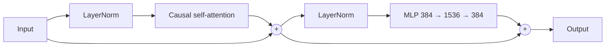
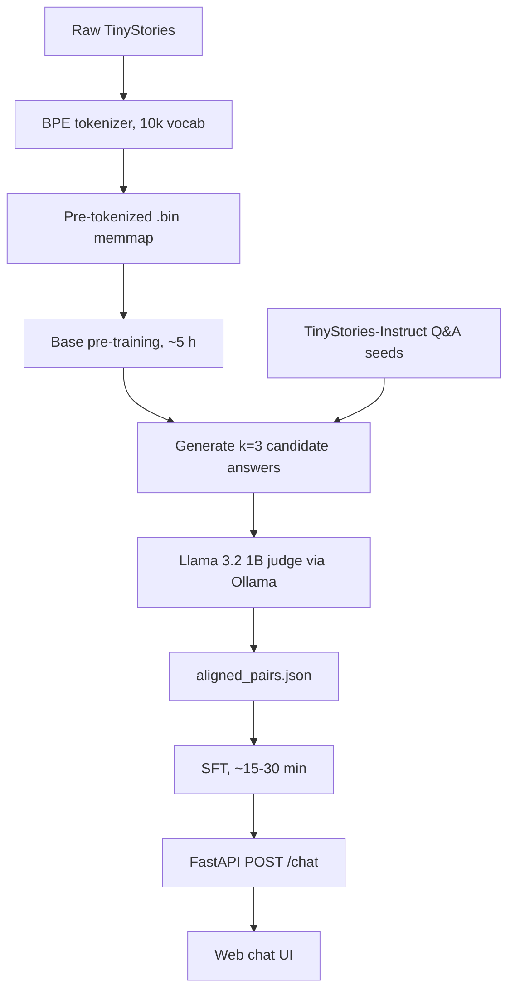
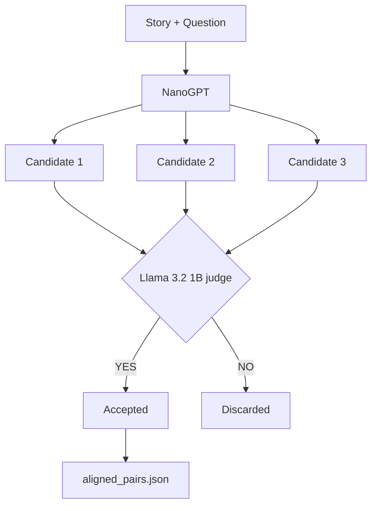

# NanoGPT: From Scratch to Aligned Story Q&A

A complete, offline LLM pipeline in PyTorch: custom BPE tokenizer, causal Transformer decoder, rejection-sampling alignment with a local Llama judge, supervised fine-tuning, and a FastAPI chat UI. Built to train and run on a **6 GB VRAM** GPU.


> **Goal:** build small, understand everything, run locally.

---

## Contents

* [Overview](#overview)
* [Results](#results)
* [Architecture](#architecture)
* [Pipeline](#pipeline)
* [Project Structure](#project-structure)
* [Quick Start](#quick-start)

  * [Prerequisites](#prerequisites)
  * [Setup](#setup)
  * [`requirements.txt`](#requirementstxt)
* [Training Guide](#training-guide)

  * [0. Download Data](#0-download-data)
  * [1. Train the Tokenizer](#1-train-the-tokenizer)
  * [2. Base Pre-training](#2-base-pre-training)
  * [3. Rejection Sampling](#3-rejection-sampling)
  * [4. Supervised Fine-tuning](#4-supervised-fine-tuning)
  * [5. Launch the UI](#5-launch-the-ui)
* [Alignment: Rejection Sampling](#alignment-rejection-sampling)
* [Prompt Format](#prompt-format)
* [API Reference](#api-reference)

  * [`POST /chat`](#post-chat)
  * [`GET /health`](#get-health)
* [Hardware and Memory Budget](#hardware-and-memory-budget)
* [Testing](#testing)
* [Troubleshooting](#troubleshooting)
* [Limitations](#limitations)
* [Roadmap](#roadmap)
* [License](#license)

---

# Overview

|               |                                                                                                                            |
| :------------ | :------------------------------------------------------------------------------------------------------------------------- |
| **Task**      | Answer factual questions about a short children's story                                                                    |
| **Data**      | [TinyStories](https://huggingface.co/datasets/roneneldan/TinyStories) for pre-training, TinyStories-Instruct for Q&A seeds |
| **Model**     | ~14.6M-parameter decoder-only Transformer                                                                                  |
| **Alignment** | Best-of-k rejection sampling judged by Llama 3.2 1B (Ollama)                                                               |
| **Serving**   | FastAPI backend and a plain HTML/CSS/JS front end                                                                          |
| **Offline**   | No cloud APIs needed after the initial data download                                                                       |

---

# Results

> Fill these in from your own runs so readers can verify the claims.

| Metric                         | Base model | After SFT |
| :----------------------------- | :--------: | :-------: |
| Validation loss                |   `TODO`   |   `TODO`  |
| Perplexity                     |   `TODO`   |   `TODO`  |
| Q&A exact match (held-out set) |   `TODO`   |   `TODO`  |
| Q&A accepted by judge (%)      |     n/a    |   `TODO`  |
| Inference latency (RTX 4050)   |     n/a    | `TODO` ms |

Reproduce with:

```bash
python -m nanogpt.evaluate --checkpoint checkpoints/sft_model_final.pt
```

---

# Architecture

| Hyperparameter   |   Value  | Notes                                                     |
| :--------------- | :------: | :-------------------------------------------------------- |
| Layers           |     6    | Pre-norm decoder blocks                                   |
| Attention heads  |     6    | Head dim 64 (384 / 6)                                     |
| Hidden size      |    384   | Residual stream width                                     |
| MLP intermediate |   1,536  | 4x expansion                                              |
| Context window   |    256   | Tokens, roughly 200 words                                 |
| Vocabulary       |  10,000  | Custom BPE                                                |
| Precision        | bfloat16 | Ampere / Ada tensor cores                                 |
| Attention kernel |   SDPA   | `F.scaled_dot_product_attention` (FlashAttention backend) |
| Weight tying     |    On    | Token embedding shared with LM head                       |

## Parameter Breakdown

| Component                                          |     Params |
| :------------------------------------------------- | ---------: |
| Token embeddings (10,000 x 384, tied with LM head) |      3.84M |
| Position embeddings (256 x 384)                    |      0.10M |
| Attention (6 layers x 4 x 384²)                    |      3.54M |
| MLP (6 layers x 2 x 384 x 1,536)                   |      7.08M |
| **Total (plus small norm params)**                 | **~14.6M** |

## Decoder Block



---

# Pipeline

Every stage runs locally.



| Stage                 | Script          | Output                          | Approx. time          |
| :-------------------- | :-------------- | :------------------------------ | :-------------------- |
| 1. Tokenizer          | `tokenizer.py`  | `tokenizer.json`, `.bin` shards | minutes               |
| 2. Pre-training       | `train_base.py` | `base_model_15M.pt`             | ~5 h                  |
| 3. Rejection sampling | `judge.py`      | `aligned_pairs.json`            | depends on seed count |
| 4. SFT                | `train_sft.py`  | `sft_model_final.pt`            | 15-30 min             |
| 5. Serve              | `app/main.py`   | chat UI at `:8000`              | n/a                   |

---

# Project Structure

```text
nanogpt/

├── configs/
│   ├── base.yaml              # Model + pre-training hyperparameters
│   └── sft.yaml               # SFT hyperparameters
│
├── scripts/
│   ├── download_data.sh       # Fetch TinyStories + Instruct data
│   └── run_all.sh             # End-to-end pipeline
│
├── src/nanogpt/               # Installable package
│   ├── __init__.py
│   ├── config.py              # Dataclasses loaded from configs/*.yaml
│   ├── tokenizer.py           # Train / encode with 10k BPE
│   ├── dataset.py             # Memmap dataset + SFT dataset with answer masking
│   ├── model.py               # Attention, MLP, decoder blocks
│   ├── train_base.py          # Pre-training loop (BF16, grad accumulation)
│   ├── generate.py            # Greedy / top-k / top-p sampling
│   ├── judge.py               # Ollama-based rejection sampler
│   ├── train_sft.py           # SFT with loss only on answer tokens
│   └── evaluate.py            # Loss, perplexity, Q&A exact match
│
├── app/
│   ├── main.py                # FastAPI app: /chat, /health
│   ├── schemas.py             # Pydantic request/response models
│   ├── inference.py           # Model loading + generation wrapper
│   └── static/                # index.html, style.css, script.js
│
├── tests/
│   ├── test_model.py          # Shapes, causality, weight tying
│   ├── test_tokenizer.py      # Round-trip encode/decode
│   └── test_masking.py        # SFT loss mask covers only the answer
│
├── data/                      # (git-ignored)
│   ├── raw/
│   ├── tokenized/
│   └── sft/
│
├── checkpoints/               # (git-ignored)
├── docs/                      # Design notes, training curves
├── .gitignore
├── LICENSE
├── Makefile                  # make setup | train | judge | sft | serve | test
├── pyproject.toml
├── requirements.txt
└── README.md
```

## Why This Layout?

* **Package under `src/`** so scripts share code via imports and run as `python -m nanogpt.<module>`, with no path hacks.
* **Configs in YAML** instead of long CLI flags, so every run is reproducible and diffable.
* **`app/` separated from training code** so the server only imports `model.py` and `generate.py`.
* **`data/` and `checkpoints/` are git-ignored**, which keeps the repo small.

---

# Quick Start

## Prerequisites

* Python 3.10+
* NVIDIA GPU with CUDA and bf16 support (e.g. RTX 4050, 6 GB)
* [Ollama](https://ollama.com) installed locally

## Setup

```bash
git clone https://github.com/yogeshsikhwal77/nanogpt.git

cd nanogpt

python -m venv venv

source venv/bin/activate        # Windows: venv\Scripts\activate

# PyTorch with CUDA
pip install torch --index-url https://download.pytorch.org/whl/cu121

# Project + dependencies
pip install -r requirements.txt
pip install -e .

# Judge model
ollama pull llama3.2:1b
```

Verify the GPU is visible:

```bash
python -c "import torch; print(torch.cuda.is_available(), torch.cuda.get_device_name(0))"
```

## `requirements.txt`

```text
torch>=2.1.0
numpy>=1.24.0
tokenizers>=0.15.0
pyyaml>=6.0
fastapi>=0.109.0
uvicorn[standard]>=0.27.0
requests>=2.31.0
tqdm>=4.66.0
pytest>=8.0.0
```

---

# Training Guide

Run everything at once with:

```bash
make all
```

Or run the stages step by step.

## 0. Download Data

```bash
bash scripts/download_data.sh
```

## 1. Train the Tokenizer

```bash
python -m nanogpt.tokenizer train --vocab-size 10000 --data-path data/raw/

python -m nanogpt.tokenizer encode --input-dir data/raw/ --output-dir data/tokenized/
```

## 2. Base Pre-training

Approximate time: **~5 h**

```bash
python -m nanogpt.train_base --config configs/base.yaml
```

`configs/base.yaml`:

```yaml
model:
  dim: 384
  layers: 6
  heads: 6
  context_len: 256
  vocab_size: 10000

train:
  batch_size: 16
  grad_accum: 4        # effective batch = 64 sequences
  lr: 1.0e-3
  epochs: 1
  seed: 42
  data_dir: data/tokenized/
  save_path: checkpoints/base_model_15M.pt
```

## 3. Rejection Sampling

```bash
python -m nanogpt.judge \
  --model-path checkpoints/base_model_15M.pt \
  --instruct-data data/raw/TinyStories-Instruct.json \
  --output data/sft/aligned_pairs.json \
  --candidates 3
```

## 4. Supervised Fine-tuning

Approximate time: **15-30 min**

```bash
python -m nanogpt.train_sft --config configs/sft.yaml
```

## 5. Launch the UI

```bash
uvicorn app.main:app --host 127.0.0.1 --port 8000

# add --reload only during development
```

Open:

http://localhost:8000

---

# Alignment: Rejection Sampling

For each story and question, the base model produces `k=3` candidate answers. The local judge accepts or rejects each one, and only accepted pairs go into the SFT set.



## SFT Loss Masking

The story and question are context only; loss is computed on answer tokens.

```text
Story:    [ masked, no loss ]

Question: [ masked, no loss ]

Answer:   [ loss on these tokens ]
```

## Judge Quality Caveat

A 1B model is a noisy judge. To keep the SFT set clean:

* Prefer comparing candidates against the reference answer from TinyStories-Instruct when one exists, and use the LLM judge only as a tiebreaker.
* Log the acceptance rate and spot-check a random sample of accepted pairs.
* Use temperature 0 for judge calls and a strict `YES`/`NO` output parser.

---

# Prompt Format

Training and inference must use the identical template. Special tokens are added to the tokenizer vocabulary.

```text
<|story|> {story} <|question|> {question} <|answer|> {answer} <|eos|>
```

At inference, the prompt stops after `<|answer|>` and generation runs until `<|eos|>` or `max_tokens`.

Inputs longer than the context window are truncated from the story side, never the question.

---

# API Reference

## `POST /chat`

```bash
curl -X POST http://localhost:8000/chat \
  -H "Content-Type: application/json" \
  -d '{
    "story": "Tim lost his red ball in the garden. He found it under the oak tree.",
    "question": "Where did Tim find the ball?",
    "temperature": 0.2,
    "max_tokens": 50
  }'
```

### Request Fields

| Field         | Type   | Default  | Notes                                  |
| :------------ | :----- | :------- | :------------------------------------- |
| `story`       | string | required | Truncated to fit the 256-token context |
| `question`    | string | required |                                        |
| `temperature` | float  | `0.2`    | Range 0-2; `0` means greedy            |
| `max_tokens`  | int    | `50`     | Capped server-side                     |

### Response

```json
{
  "answer": "Under the oak tree.",
  "tokens_generated": 5,
  "inference_time_ms": 42.1
}
```

### Errors

| Status | Meaning                  |
| :----- | :----------------------- |
| `422`  | Missing or invalid field |
| `503`  | Model not loaded yet     |

## `GET /health`

Returns:

```json
{
  "status": "ok",
  "device": "cuda"
}
```

The endpoint returns this once the model is loaded.

---

# Hardware and Memory Budget

Fits a 6 GB GPU by combining:

* bfloat16 mixed precision
* gradient accumulation (16 x 4 = 64 sequences per optimizer step)
* 256-token context and a compact 384-wide model
* memory-mapped pre-tokenized data (no dataset held in RAM)
* SDPA fused attention

If you hit CUDA out-of-memory, lower `batch_size` and raise `grad_accum` to keep the effective batch at 64.

---

# Testing

Run:

```bash
pytest -q
```

| Test                | Checks                                                                |
| :------------------ | :-------------------------------------------------------------------- |
| `test_model.py`     | Output shapes, causal mask (token *t* never sees *t+1*), tied weights |
| `test_tokenizer.py` | Encode/decode round trip, special tokens present                      |
| `test_masking.py`   | SFT labels are `-100` everywhere except answer tokens                 |

---

# Troubleshooting

| Problem                                | Fix                                                                         |
| :------------------------------------- | :-------------------------------------------------------------------------- |
| `CUDA out of memory`                   | Halve `batch_size`, double `grad_accum`                                     |
| `torch.cuda.is_available()` is `False` | Reinstall PyTorch with the matching CUDA wheel (`cu121`)                    |
| Judge step hangs or connection refused | Start Ollama (`ollama serve`) and confirm `ollama list` shows `llama3.2:1b` |
| Nonsense or repeated answers           | Check the prompt template matches training; lower temperature               |
| Loss goes to NaN                       | Lower `lr`, add gradient clipping (`max_norm=1.0`)                          |

---

# Limitations

* Domain-bound to simple children's stories; no broad world knowledge.
* Weak at multi-step reasoning and arithmetic.
* 256-token context, so long stories are truncated.
* Answer quality depends on the base model and the noisy 1B judge.
* Much smaller than modern general-purpose LLMs; intended for learning and experimentation.

---

# Roadmap

* [ ] Add evaluation script and publish results table
* [ ] Reference-answer filtering to complement the LLM judge
* [ ] Learning-rate warmup + cosine schedule ablation
* [ ] KV-cache for faster generation
* [ ] Streaming responses in the chat UI
* [ ] Docker image for the API

---

# License

MIT. See [`LICENSE`](LICENSE).
