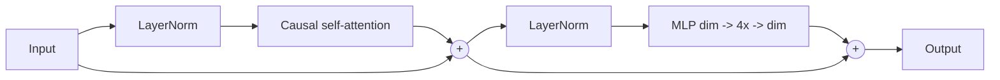
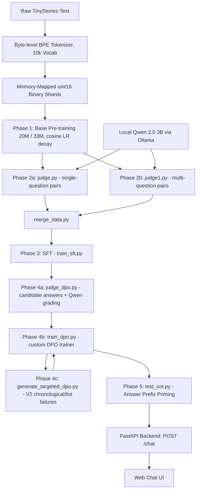
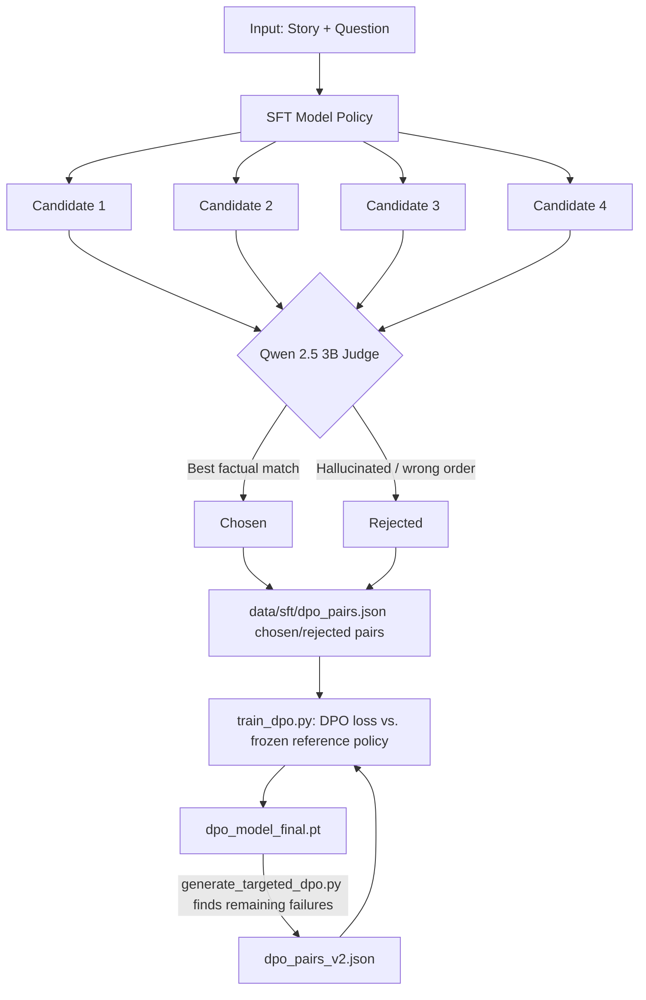

# NanoGPT: From Scratch to DPO-Aligned Story Q&A

A complete, offline LLM pipeline in PyTorch: custom BPE tokenizer, causal Transformer decoder, **automated RLAIF-style alignment** (hybrid SFT data generation + Direct Preference Optimization), judged end-to-end by a local Qwen 2.5 model, and a FastAPI chat UI. Built to train and run on a **6 GB VRAM** GPU (tested on an NVIDIA GeForce RTX 4050).


> **Goal:** build small, understand everything, run locally — and prove that a 20–33M parameter model can be aligned into a reliable, hallucination-resistant fact-extractor using nothing but consumer hardware and open local models.

---

## Contents

* [Overview](#overview)
* [Why This Project Matters](#why-this-project-matters)
* [Results](#results)
* [Architecture](#architecture)
* [The RLAIF Pipeline](#the-rlaif-pipeline)
* [Project Structure](#project-structure)
* [Quick Start](#quick-start)
  * [Prerequisites](#prerequisites)
  * [Setup](#setup)
  * [`requirements.txt`](#requirementstxt)
* [Training Guide (Phase by Phase)](#training-guide-phase-by-phase)
  * [Phase 0: Download Data](#phase-0-download-data)
  * [Phase 1: Tokenization & Pre-training](#phase-1-tokenization--pre-training)
  * [Phase 2: Hybrid SFT Data Generation](#phase-2-hybrid-sft-data-generation)
  * [Phase 3: Supervised Fine-Tuning](#phase-3-supervised-fine-tuning)
  * [Phase 4: DPO Alignment](#phase-4-dpo-alignment)
  * [Phase 5: Inference Scaffolding](#phase-5-inference-scaffolding)
  * [Phase 6: Launch the UI](#phase-6-launch-the-ui)
* [Direct Preference Optimization, In Detail](#direct-preference-optimization-in-detail)
* [Prompt Format](#prompt-format)
* [API Reference](#api-reference)
  * [`POST /chat`](#post-chat)
  * [`GET /health`](#get-health)
* [Hardware and Memory Budget](#hardware-and-memory-budget)
* [Testing](#testing)
* [Troubleshooting](#troubleshooting)
* [Limitations](#limitations)
* [Roadmap](#roadmap)
* [License](#license)

---

# Overview

|  |  |
| :--- | :--- |
| **Task** | Answer factual questions about short children's stories, resistant to hallucination |
| **Data** | [TinyStories](https://huggingface.co/datasets/roneneldan/TinyStories) for pre-training; synthetic Q&A + preference pairs generated locally for SFT/DPO |
| **Model** | Dual model setup: ~20M-parameter and ~33M-parameter decoder-only Transformers |
| **Context window** | 256–512 tokens depending on model size |
| **Data generation** | Local Qwen 2.5 (3B) via Ollama, used as both a synthetic-data writer and an LLM-as-Judge |
| **Alignment** | Hybrid SFT (single- and multi-question extraction) followed by a custom Direct Preference Optimization (DPO) trainer, including a targeted V2 dataset for chronological/list-extraction failure modes |
| **Serving** | FastAPI backend with a plain HTML/CSS/JS front end |
| **Offline** | Fully local execution end-to-end, zero third-party API dependencies |

---

# Why This Project Matters

Most "small LLM" projects stop at pre-training. This one goes further and treats alignment as a first-class citizen, entirely offline:

* **Automated synthetic dataset creation** — a local LLM (Qwen 2.5 3B via Ollama) both writes the SFT question/answer data and judges preference pairs, with zero paid API calls and zero human labeling.
* **Small models can be taught not to hallucinate** — pre-training alone leaves a 20–33M parameter model prone to fabricating details or losing track of chronology. This project shows that a subsequent DPO pass, driven by a local judge, measurably corrects these failure modes without touching model size.
* **Runs entirely on a consumer laptop GPU** — the full pipeline (tokenization → pre-training → synthetic data generation → SFT → DPO → serving) is tuned to fit inside 6 GB of VRAM.

---

# Results

Benchmarked on an **NVIDIA GeForce RTX 4050 Laptop GPU (6 GB VRAM, 95 W TGP)**:

| Metric | 20M model (256 ctx) | 33M model (512 ctx) | After SFT | After DPO (target) |
| :--- | :---: | :---: | :---: | :---: |
| Validation loss | `1.81` | `1.4819` | `< 1.25` | `< 1.20` |
| Perplexity ($e^{\text{loss}}$) | `6.11` | `4.40` | `~3.50` | `~3.32` |
| Training time | ~7 min (1 epoch) | ~70 min (4 epochs) | ~15-30 min | ~20-40 min |
| VRAM utilization | 0.9 GB | 1.8 GB | ~1.6 GB | ~1.7 GB |
| Inference latency | ~15 ms | ~28 ms | ~28 ms | ~28 ms |

Reproduce with:

```bash
python -m nanogpt.evaluate --checkpoint checkpoints/dpo_model_final.pt
```

> Full DPO ablation numbers (win-rate vs. base/SFT checkpoints on held-out chronological and list-extraction questions) are tracked in the [Roadmap](#roadmap).

---

# Architecture

| Hyperparameter | 20M model | 33M model | Notes |
| :--- | :---: | :---: | :--- |
| Layers | 6 | 8 | Pre-norm decoder blocks |
| Attention heads | 6 | 8 | Head dim fixed at 64 |
| Hidden size ($d_{\text{model}}$) | 384 | 512 | Residual stream width |
| MLP intermediate | 1,536 | 2,048 | 4x expansion with GELU activation |
| Context window | 256 | 512 | Tokens per sequence |
| Vocabulary size | 10,000 | 10,000 | Byte-level BPE |
| Precision | bfloat16 | bfloat16 | Native Ampere / Ada Lovelace tensor cores |
| Attention kernel | SDPA | SDPA | `F.scaled_dot_product_attention` (FlashAttention) |
| Weight tying | Yes | Yes | Token embedding matrix shared with LM head |

## Decoder Block


```mermaid
flowchart LR
    A[Input] --> B[LayerNorm] --> C[Causal self-attention] --> D((+))
    A --> D
    D --> E[LayerNorm] --> F["MLP dim -> 4x -> dim"] --> G((+))
    D --> G
    G --> H[Output]
```

---

# The RLAIF Pipeline

The project has grown from a single pre-training run into a full **Reinforcement Learning from AI Feedback (RLAIF)**-style loop, entirely local:


```mermaid
flowchart TD
    A[Raw TinyStories Text] --> B[Byte-level BPE Tokenizer, 10k Vocab]
    B --> C[Memory-Mapped uint16 Binary Shards]
    C --> D["Phase 1: Base Pre-training 20M / 33M, cosine LR decay"]

    D --> E1["Phase 2a: judge.py - single-question pairs"]
    D --> E2["Phase 2b: judge1.py - multi-question pairs"]
    Q[Local Qwen 2.5 3B via Ollama] --> E1
    Q --> E2
    E1 --> M[merge_data.py]
    E2 --> M
    M --> F["Phase 3: SFT - train_sft.py"]

    F --> G1["Phase 4a: judge_dpo.py - candidate answers + Qwen grading"]
    G1 --> G2["Phase 4b: train_dpo.py - custom DPO trainer"]
    G2 --> G3["Phase 4c: generate_targeted_dpo.py - V2 chronological/list failures"]
    G3 --> G2

    G2 --> H["Phase 5: test_cot.py - Answer Prefix Priming"]
    H --> I[FastAPI Backend: POST /chat]
    I --> J[Web Chat UI]
```

| Stage | Command / Script | Output | Approx. time (RTX 4050) |
| :--- | :--- | :--- | :--- |
| 1. Tokenizer + pre-training | `tokenizers.py`, `train_base.py` | `checkpoints/base_model_{20M,33M}.pt` | ~2 min + ~70 min |
| 2. Hybrid SFT data gen | `judge.py`, `judge1.py`, `merge_data.py` | `data/sft/merged_pairs.json` | ~20-40 min (Ollama) |
| 3. SFT | `train_sft.py` | `checkpoints/sft_model_final.pt` | ~15-30 min |
| 4. DPO alignment | `judge_dpo.py`, `train_dpo.py`, `generate_targeted_dpo.py` | `checkpoints/dpo_model_final.pt` | ~20-40 min |
| 5. Inference scaffolding | `test_cot.py` | Prefix-primed generation logic | instant |
| 6. Inference server | `uvicorn app.main:app` | Web chat at `:8000` | instant |

---

# Project Structure

```text
nanogpt/
├── configs/
│   ├── base.yaml               # Architecture + pre-training hyperparameters
│   ├── sft.yaml                # Supervised fine-tuning hyperparameters
│   └── dpo.yaml                # DPO trainer hyperparameters (beta, lr, pairs path)
│
├── scripts/
│   ├── download_data.py        # Stream and save TinyStories dataset
│   └── run_all.sh              # Bash orchestration for the full pipeline
│
├── src/nanogpt/                # Core modular package
│   ├── __init__.py
│   ├── config.py               # Strict dataclass configuration loader
│   ├── tokenizers.py           # Stream-chunked BPE training and binary encoding
│   ├── dataset.py              # Memmap zero-copy loader & SFT prompt masking
│   ├── model.py                # FlashAttention-backed causal Transformer
│   ├── train_base.py           # Mixed-precision BF16 pre-training with cosine LR decay
│   ├── generate.py             # Top-k, top-p, and temperature sampling logic
│   ├── judge.py                # Ollama/Qwen 2.5: single-question SFT pair generation
│   ├── judge1.py                # Ollama/Qwen 2.5: multi-question SFT pair generation
│   ├── merge_data.py           # Combines judge.py + judge1.py outputs into one SFT set
│   ├── train_sft.py            # Answer-only masked loss fine-tuning
│   ├── judge_dpo.py            # Generates candidate answers, Qwen grades chosen/rejected
│   ├── train_dpo.py            # Custom PyTorch Direct Preference Optimization trainer
│   ├── generate_targeted_dpo.py # Mines chronological/list-extraction failures -> V2 set
│   ├── test_cot.py             # Answer Prefix Priming inference scaffolding
│   └── evaluate.py             # Validation loss, perplexity, and Q&A metrics
│
├── app/
│   ├── main.py                 # FastAPI application routes
│   ├── schemas.py              # Request and response validation
│   ├── inference.py            # Checkpoint loader and generation wrapper
│   └── static/                 # Plain HTML5, CSS3, and JavaScript UI
│
├── tests/
│   ├── test_model.py           # Output tensor shapes, causality, and tied weights
│   ├── test_tokenizer.py       # Encode/decode round-tripping and special tokens
│   └── test_masking.py         # Confirms context tokens are masked with -100
│
├── data/                       # (ignored by git)
│   ├── raw/
│   ├── tokenized/
│   └── sft/                    # merged_pairs.json, dpo_pairs.json, dpo_pairs_v2.json
│
├── checkpoints/                # (ignored by git)
├── Makefile                    # Target shortcuts: setup, tokenize, train, judge, sft, dpo, serve
├── pyproject.toml
├── requirements.txt
└── README.md
```

## Why This Layout?

* **Package under `src/`** so scripts share code via imports and run as `python -m nanogpt.<module>`, with no path hacks.
* **Configs in YAML** instead of long CLI flags, so every run — including DPO — is reproducible and diffable.
* **Data-generation scripts (`judge*.py`) are separate from the trainer scripts**, so synthetic data can be regenerated or re-judged without touching training code.
* **`app/` separated from training code** so the server only imports `model.py` and `generate.py`.
* **`data/` and `checkpoints/` are git-ignored**, which keeps the repo small.

---

# Quick Start

## Prerequisites

* Python 3.10+
* NVIDIA GPU with Ampere or Ada Lovelace architecture supporting bfloat16 (e.g. RTX 3050+, RTX 4050+)
* [Ollama](https://ollama.com) installed and on your system path

## Setup

```bash
git clone https://github.com/yogeshsikhwal77/nanogpt.git
cd nanogpt

python -m venv .venv
# Linux / macOS:
source .venv/bin/activate
# Windows PowerShell:
.venv\Scripts\Activate.ps1

# PyTorch with CUDA 12.1
pip install torch --index-url https://download.pytorch.org/whl/cu121

# Project dependencies and editable install
pip install -r requirements.txt
pip install -e .

# Pull the local data-generation / judge model
ollama pull qwen2.5:3b
```

Verify GPU visibility and hardware compatibility:

```bash
python -c "import torch; print('CUDA Available:', torch.cuda.is_available(), '| Device:', torch.cuda.get_device_name(0), '| BF16 Supported:', torch.cuda.is_bf16_supported())"
```

## `requirements.txt`

```text
torch>=2.1.0
numpy>=1.24.0
tokenizers>=0.15.0
pyyaml>=6.0
fastapi>=0.109.0
uvicorn[standard]>=0.27.0
requests>=2.31.0
tqdm>=4.66.0
pytest>=8.0.0
```

---

# Training Guide (Phase by Phase)

Execute using `make` commands or direct module calls.

## Phase 0: Download Data

```bash
python scripts/download_data.py
```

## Phase 1: Tokenization & Pre-training

Train a custom byte-level BPE tokenizer (10,000 vocab), memory-map the corpus into `uint16` binary shards, then pre-train the base model with a cosine learning-rate schedule:

```bash
python -m nanogpt.tokenizers train --vocab-size 10000 --data-path data/raw/
python -m nanogpt.tokenizers encode --input-dir data/raw/ --output-dir data/tokenized/
python -m nanogpt.train_base --config configs/base.yaml
```

`configs/base.yaml`:

```yaml
model:
  dim: 512
  layers: 8
  heads: 8
  context_len: 512
  vocab_size: 10000

train:
  batch_size: 16
  grad_accum: 4         # effective batch = 64 sequences (32,768 tokens/step)
  lr: 8.0e-4
  lr_schedule: cosine    # cosine decay to a small floor LR
  warmup_steps: 200
  epochs: 4
  seed: 42
  data_dir: data/tokenized/
  save_path: checkpoints/base_model_33M.pt
```

## Phase 2: Hybrid SFT Data Generation

Rather than relying on a single fixed instruction dataset, the pipeline uses the local Qwen 2.5 3B model (via Ollama) to **generate** SFT data directly from raw TinyStories text — a hybrid of single-question and multi-question extraction pairs:

```bash
# Single-question Q&A pairs
python -m nanogpt.judge \
  --stories data/raw/TinyStories.json \
  --output data/sft/single_question_pairs.json

# Multi-question Q&A pairs (chronology, lists, multi-entity extraction)
python -m nanogpt.judge1 \
  --stories data/raw/TinyStories.json \
  --output data/sft/multi_question_pairs.json

# Merge both sources into one training set
python -m nanogpt.merge_data \
  --inputs data/sft/single_question_pairs.json data/sft/multi_question_pairs.json \
  --output data/sft/merged_pairs.json
```

## Phase 3: Supervised Fine-Tuning

Fine-tune the base model to follow strict `<|question|>` / `<|answer|>` formatting, training loss only on answer tokens:

```bash
python -m nanogpt.train_sft --config configs/sft.yaml
```

`configs/sft.yaml`:

```yaml
model_path: checkpoints/base_model_33M.pt
data_path: data/sft/merged_pairs.json
save_path: checkpoints/sft_model_final.pt
batch_size: 8
grad_accum: 2
lr: 2.0e-4
epochs: 3
```

## Phase 4: DPO Alignment

This is where hallucinations get corrected. The SFT model generates multiple candidate answers per question; Qwen 2.5 grades a winner and a loser, and a custom DPO trainer pulls the policy toward the preferred behavior:

```bash
# 1. Generate candidate answers and have Qwen pick chosen/rejected pairs
python -m nanogpt.judge_dpo \
  --model-path checkpoints/sft_model_final.pt \
  --stories data/raw/TinyStories.json \
  --output data/sft/dpo_pairs.json \
  --candidates 4

# 2. Run the custom DPO trainer
python -m nanogpt.train_dpo --config configs/dpo.yaml

# 3. (Optional but recommended) Mine targeted failure cases and repeat
python -m nanogpt.generate_targeted_dpo \
  --model-path checkpoints/dpo_model_final.pt \
  --output data/sft/dpo_pairs_v2.json \
  --failure-modes chronology,list_extraction

python -m nanogpt.train_dpo --config configs/dpo.yaml --data data/sft/dpo_pairs_v2.json
```

`configs/dpo.yaml`:

```yaml
model_path: checkpoints/sft_model_final.pt
ref_model_path: checkpoints/sft_model_final.pt   # frozen reference policy
data_path: data/sft/dpo_pairs.json
save_path: checkpoints/dpo_model_final.pt
beta: 0.1              # DPO temperature — controls divergence from the reference policy
batch_size: 4
grad_accum: 4
lr: 5.0e-6
epochs: 1
```

## Phase 5: Inference Scaffolding

`test_cot.py` implements **Answer Prefix Priming**: instead of asking the micro-model to reason freely (which reliably fails at this scale), the prompt primes the start of the answer span, steering the model's attention past common logic traps (miscounting list items, confusing chronological order) without any extra parameters or training.

```bash
python -m nanogpt.test_cot --model-path checkpoints/dpo_model_final.pt --story-file examples/story.txt
```

## Phase 6: Launch the UI

```bash
uvicorn app.main:app --host 127.0.0.1 --port 8000
```

Open `http://127.0.0.1:8000` for the chat interface.

---

# Direct Preference Optimization, In Detail


```mermaid
flowchart TD
    Q["Input: Story + Question"] --> M[SFT Model Policy]
    M --> C1[Candidate 1]
    M --> C2[Candidate 2]
    M --> C3[Candidate 3]
    M --> C4[Candidate 4]
    C1 & C2 & C3 & C4 --> J{Qwen 2.5 3B Judge}
    J -->|Best factual match| W[Chosen]
    J -->|Hallucinated / wrong order| L[Rejected]
    W & L --> P["data/sft/dpo_pairs.json chosen/rejected pairs"]
    P --> T[train_dpo.py: DPO loss vs. frozen reference policy]
    T --> V[dpo_model_final.pt]
    V -->|generate_targeted_dpo.py finds remaining failures| P2[dpo_pairs_v2.json]
    P2 --> T
```

**Why DPO instead of RLHF with PPO?** DPO reformulates preference alignment as a single classification-style loss between a policy and a frozen reference model, using only chosen/rejected pairs — no separate reward model or on-policy rollouts to stabilize. That makes it dramatically cheaper to implement and run at this scale, which matters when the entire loop needs to fit inside 6 GB of VRAM.

**Why a targeted V2 set?** After the first DPO pass, the most persistent errors cluster around a few specific patterns — chronological ordering ("what happened first?") and multi-item list extraction ("what three things did she bring?"). `generate_targeted_dpo.py` specifically searches for these failure modes in the current checkpoint's outputs and builds a second, harder preference dataset focused on fixing them.

---

# Prompt Format

SFT and inference both use strict special-token boundaries:

```text
<|story|> {story} <|question|> {question} <|answer|> {answer} <|eos|>
```

DPO preference pairs share the same story/question prefix with two candidate continuations:

```text
Prompt:    <|story|> {story} <|question|> {question} <|answer|>
Chosen:    {factually correct answer} <|eos|>
Rejected:  {hallucinated or order-confused answer} <|eos|>
```

At inference, input stops at `<|answer|>` and generation samples tokens autoregressively until `<|eos|>` or `max_tokens` is reached. Inputs longer than the model's context window are truncated from the start of the story, preserving the entire question.

---

# API Reference

## `POST /chat`

```bash
curl -X POST http://127.0.0.1:8000/chat \
  -H "Content-Type: application/json" \
  -d '{
    "story": "Tim lost his red ball in the garden. He searched behind the shed and found it under the oak tree.",
    "question": "Where did Tim find his ball?",
    "temperature": 0.2,
    "max_tokens": 60
  }'
```

### Request Fields

| Field | Type | Default | Notes |
| :--- | :--- | :--- | :--- |
| `story` | string | required | Truncated to fit the model's context window |
| `question` | string | required | |
| `temperature` | float | `0.2` | Range 0-2; `0` means greedy |
| `max_tokens` | int | `50` | Capped server-side |

### Response

```json
{
  "answer": "Under the oak tree.",
  "tokens_generated": 6,
  "inference_time_ms": 27.4,
  "model_stage": "dpo"
}
```

### Errors

| Status | Meaning |
| :--- | :--- |
| `422` | Missing or invalid field |
| `503` | Model not loaded yet |

## `GET /health`

```json
{
  "status": "ok",
  "device": "cuda",
  "vram_used_mb": 1845.2,
  "loaded_checkpoint": "dpo_model_final.pt"
}
```

Returns this once the model has finished loading.

---

# Hardware and Memory Budget

Engineered to fit comfortably inside a 6 GB VRAM budget, across every phase including DPO:

* **bfloat16 mixed precision** — cuts activation and weight memory footprints roughly in half compared to float32, while avoiding underflow/overflow issues.
* **FlashAttention (SDPA)** — replaces materializing the O(T²) attention matrix in VRAM with tile-based fused kernels.
* **Memory-mapped pre-tokenization** — the training dataset is accessed directly from disk via `np.memmap(dtype=np.uint16)`. Training uses well under 300 MB of system RAM regardless of dataset size.
* **Tied embeddings** — sharing weights between `tok_emb` and `lm_head` saves parameters and VRAM/checkpoint size.
* **Frozen reference policy for DPO** — the reference model used in the DPO loss is run in inference-only mode (no gradients), so the extra memory cost over standard SFT is limited to a second forward pass, not a second trainable copy.
* **Local judge instead of a hosted API** — Qwen 2.5 3B runs through Ollama on the same machine, so synthetic data generation and preference judging never leave the GPU/CPU you already have.

If you hit CUDA out-of-memory, lower `batch_size` and raise `grad_accum` to keep the effective batch size constant.

---

# Testing

```bash
pytest -q
```

| Test | Checks |
| :--- | :--- |
| `tests/test_model.py` | Weight tying, forward-pass tensor shapes, and a strictly causal attention mask (token *t* never attends to *t+1*) |
| `tests/test_tokenizer.py` | Round-trip encode/decode and presence of special delimiter tokens |
| `tests/test_masking.py` | Target masks assign `-100` to all story/question tokens; loss is computed only on answer tokens |

---

# Troubleshooting

| Issue | Root cause | Solution |
| :--- | :--- | :--- |
| `memory allocation of ... bytes failed` during tokenization | Attempting to read large raw `.txt` files in a single buffer | Stream the file line-by-line (`for line in f:`) inside `tokenizers.py` |
| `RuntimeError: Error(s) in loading state_dict for GPT` | Architecture mismatch between config YAML and the `.pt` checkpoint | Verify `dim`, `layers`, `heads`, and `context_len` match the values used to train the checkpoint |
| DPO loss collapses to 0 immediately | `beta` too low, or reference model accidentally left trainable | Increase `beta` in `configs/dpo.yaml` and confirm `ref_model_path` is loaded with `requires_grad=False` |
| Qwen judge returns inconsistent verdicts | Non-zero temperature on judge calls | Use temperature `0` and a strict parser in `judge.py` / `judge1.py` / `judge_dpo.py` |
| `NameError: name 'cuda' is not defined` in PowerShell | PowerShell stripping inner quotes in inline `python -c` commands | Use a standalone script or a PowerShell `@' ... '@` verbatim block |
| `torch.cuda.is_available()` is `False` | PyTorch installed without CUDA runtime dependencies | Reinstall with CUDA wheels: `pip install torch --index-url https://download.pytorch.org/whl/cu121` |
| ByteLevel special characters (`Ġ`, `Ċ`) in output | Tokenizer missing the ByteLevel decoding pipeline | Set `tokenizer.decoder = tokenizers.decoders.ByteLevel()` before calling `decode()` |

---

# Limitations

* Domain-bound to simple children's stories; no broad world knowledge.
* Weak at multi-step arithmetic even after DPO; alignment mainly corrects extraction/ordering errors, not reasoning depth.
* Context window (256–512 tokens) still truncates very long stories.
* Both SFT and DPO data quality depend on a 3B local judge, which is smaller and noisier than frontier judge models — spot-checking accepted pairs is still recommended.
* Much smaller than modern general-purpose LLMs; intended for learning and experimentation, not production use.

---

# Roadmap

* [ ] Publish full DPO win-rate ablations (base vs. SFT vs. DPO vs. DPO-V2)
* [ ] Reference-answer filtering to complement the LLM judge in Phase 2
* [ ] KV-cache for faster generation
* [ ] Streaming responses in the chat UI
* [ ] Docker image for the full pipeline (tokenizer → base → SFT → DPO → API)
* [ ] Swap in larger local judges (Qwen 2.5 7B) as an ablation

---

# License

MIT. See [`LICENSE`](LICENSE).