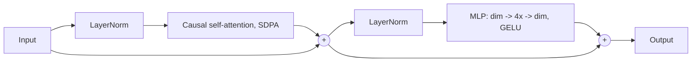
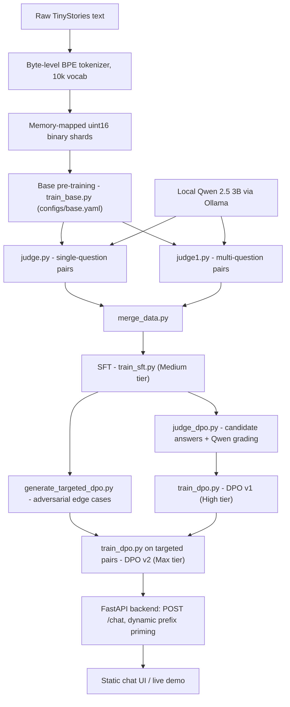

# Part 1 — Architecture & Pipeline

_Part of the full documentation for [nanoGPT](https://github.com/yogeshsikhwal77/nanoGPT). See also: [Part 2 — Training Guide](02-training-guide.md) · [Part 3 — Serving & Reference](03-serving-and-reference.md)._

## Contents

* [Overview](#overview)
* [Why This Project Matters](#why-this-project-matters)
* [Architecture](#architecture)
* [A Recorded Training Run](#a-recorded-training-run)
* [The RLAIF Pipeline](#the-rlaif-pipeline)
* [Project Structure](#project-structure)

---

## Overview

|  |  |
| :--- | :--- |
| **Task** | Answer factual questions about short children's stories, resistant to hallucination |
| **Data** | [TinyStories](https://huggingface.co/datasets/roneneldan/TinyStories) for pre-training; [TinyStories-Instruct](https://huggingface.co/datasets/roneneldan/TinyStories-Instruct) as seed material for synthetic Q&A + preference pairs |
| **Models** | **Fire** (~33M params, 512 ctx) and **Fiko** (~15M params, 256 ctx) decoder-only Transformers |
| **Tiers per model** | Medium (SFT) → High (DPO v1) → Max (targeted DPO v2) |
| **Data generation & judging** | Local Qwen 2.5 (3B) via Ollama — writes SFT Q&A pairs and grades DPO preference pairs |
| **Serving** | FastAPI backend (`app/main.py`) + a static HTML/CSS/JS chat UI, deployed via Docker |
| **Live deployment** | https://nanogpt-ic7p.onrender.com/ |
| **Offline** | Training and data generation run fully locally, zero third-party API dependencies |

---

## Why This Project Matters

* **Automated synthetic dataset creation** — a local LLM (Qwen 2.5 3B via Ollama) both writes the SFT question/answer data and judges preference pairs, with zero paid API calls and zero human labeling.
* **Small models can be taught not to hallucinate** — pre-training alone leaves a 15–33M parameter model prone to fabricating details or losing track of chronology. A subsequent DPO pass, driven by a local judge, measurably corrects these failure modes without touching model size.
* **Runs entirely on a consumer laptop GPU** — the full pipeline (tokenization → pre-training → synthetic data generation → SFT → DPO → serving) is tuned to fit inside 6 GB of VRAM.
* **Production inference doesn't even need a GPU** — the deployed app's `requirements.txt` installs a **CPU-only** build of PyTorch (`--extra-index-url .../whl/cpu`); only training needs CUDA.

---

## Architecture

Both models share the same block design (`src/nanogpt/model.py`) and differ only in width/depth/context:

| Hyperparameter | Fiko | Fire | Notes |
| :--- | :---: | :---: | :--- |
| Layers | 6 | 8 | Pre-norm decoder blocks |
| Attention heads | 6 | 8 | Head dim fixed at 64 |
| Hidden size (`dim`) | 384 | 512 | Residual stream width |
| MLP intermediate | 1,536 | 2,048 | 4× expansion, GELU activation, no bias |
| Context window | 256 | 512 | Tokens per sequence |
| Vocabulary size | 10,000 | 10,000 | Byte-level BPE (`tokenizer.json`) |
| Position embedding | Learned, absolute | Learned, absolute | `nn.Embedding(context_len, dim)` added to token embeddings |
| Precision | bfloat16 autocast | bfloat16 autocast | Native Ampere/Ada Lovelace tensor cores |
| Attention kernel | SDPA | SDPA | `F.scaled_dot_product_attention(..., is_causal=True)` (FlashAttention) |
| Weight tying | Yes | Yes | `lm_head.weight = tok_emb.weight` |

You can get the exact parameter count for any config with:

```bash
python -m nanogpt.model      # instantiates GPT from configs/base.yaml and prints model.num_params()
```

### Decoder Block



---

## A Recorded Training Run

Numbers below are from an actual run of the Fire (33M) pipeline, end to end:

| Stage | Result |
| :--- | :--- |
| Tokenizer training | 10,000-vocab BPE tokenizer trained on ~276 MB of raw text |
| Base pre-training | 7,424 steps, **val_loss 1.4520**, 71.4 minutes |
| SFT data generation | 1,000 single-question pairs (~9 min) + 1,458 multi-question pairs from 500 stories (~15 min) |
| SFT (2 epochs) | Epoch 1 val_loss 1.1364 → Epoch 2 val_loss **1.0540** (best), new checkpoint saved each time |
| DPO preference generation | 500 candidate pairs attempted → **292 graded pairs saved** (judge skipped/discarded the rest) |
| DPO v1 (baseline) | DPO loss stayed close to `ln(2) ≈ 0.693` throughout — expected at the very start of preference training |
| Targeted failure mining | 198 chronology/list-extraction contrastive pairs mined from the v1 checkpoint |
| DPO v2 (targeted, gentler lr/beta) | DPO loss dropped further, to **~0.667** by the end of the pass — a clearer, measurable preference signal than v1 |

One observation worth checking if you rerun this: in the DPO-preference-generation log, the judge's chosen answer ("Winner") was **`B` for the large majority of the run** shown. That's consistent with either a genuine quality difference between candidate generation strategies, or a positional/order bias in the judge prompt (`judge_dpo.py`) — worth a quick manual spot-check of a sample of "B" wins if you want to rule out order bias before trusting the resulting preference data.

No equivalent recorded run exists yet for Fiko (15M) in this repository.

---

## The RLAIF Pipeline



| Stage | Script(s) | Typical output |
| :--- | :--- | :--- |
| 1. Tokenizer | `tokenizers.py` | `tokenizer.json` |
| 2. Base pre-training | `train_base.py` | `checkpoints/base_model_{15M,33M}.pt` |
| 3. Hybrid SFT data gen | `judge.py`, `judge1.py`, `merge_data.py` | `data/sft/merged_pairs.json` |
| 4. SFT | `train_sft.py` | `checkpoints/sft_model_{15M,33M}.pt` |
| 5. DPO data gen | `generate_targeted_dpo.py`, `judge_dpo.py` | `data/dpo/dpo_pairs.json`, `data/dpo/targeted_dpo_pairs.json` |
| 6. DPO alignment | `train_dpo.py` (run twice) | `checkpoints/dpo_model_{15M,33M}_v1.pt` → `..._v2.pt` |
| 7. Evaluation | `evaluate.py` | Validation loss / perplexity |
| 8. Serving | `app/main.py`, `app/inference.py` | `POST /chat` |

Exact, verified commands for each stage are in [Part 2 — Training Guide](02-training-guide.md).

---

## Project Structure

```text
nanoGPT/
├── app/
│   ├── main.py                   # FastAPI routes, engine registry, dynamic-prefix decoding
│   ├── schemas.py                # ChatRequest / ChatResponse / HealthResponse (pydantic)
│   ├── inference.py               # Checkpoint loader + raw autoregressive generation
│   └── static/
│       └── index.html             # Chat UI (model/tier picker, temperature, max_tokens)
│
├── src/nanogpt/
│   ├── config.py                  # ModelConfig / TrainConfig / SFTConfig dataclasses
│   ├── tokenizers.py              # `train` / `encode` subcommands for the BPE tokenizer
│   ├── dataset.py                 # Memmap pretrain dataset, SFT dataset, overfit dataset
│   ├── model.py                   # GPT: causal attention (SDPA) + MLP blocks, weight tying
│   ├── train_base.py              # Base pre-training loop (always reads configs/base.yaml)
│   ├── judge.py                   # Ollama/Qwen 2.5: single-question SFT pairs
│   ├── judge1.py                  # Ollama/Qwen 2.5: multi-question SFT pairs
│   ├── merge_data.py              # Merges judge.py + judge1.py output (hardcoded paths)
│   ├── train_sft.py               # Answer-only masked-loss fine-tuning
│   ├── judge_dpo.py               # Candidate generation + Qwen chosen/rejected grading
│   ├── train_dpo.py               # Custom DPO trainer (CLI-driven, no YAML)
│   ├── generate_targeted_dpo.py   # Mines chronology/list-extraction failures → v2 data
│   └── evaluate.py                # Validation loss, perplexity, latency benchmarking
│
├── configs/
│   ├── base.yaml                  # Architecture + pre-training hyperparameters (Fire, by default)
│   ├── sft_15M.yaml                # SFT hyperparameters — Fiko
│   └── sft_33M.yaml                # SFT hyperparameters — Fire
│
├── scripts/
│   ├── download_data.py           # Pulls TinyStories + TinyStories-Instruct via 🤗 `datasets`
│   └── overfit_test.py            # Small-batch overfit sanity check
│
├── checkpoints/                    # base_model_33M.pt, sft_model_33M.pt, dpo_model_33M_v1/v2.pt
│                                    #   — tracked with Git LFS; *.pt is intentionally NOT in .gitignore
├── tests/
│   └── test_model.py               # Shape, weight-tying, causality, ignore_index tests
│
├── sample.py                       # Standalone unconditional generation from the base checkpoint
├── test_cot.py                     # Standalone Answer-Prefix-Priming demo script
├── tokenizer.json
├── Dockerfile                      # python:3.11-slim, installs requirements.txt, serves on :7860
├── Makefile                        # setup / tokenize / train / judge / sft / serve / test
├── pyproject.toml
├── requirements.txt                # Production/serving deps — CPU-only torch
└── README.md
```

`data/` is git-ignored entirely; `checkpoints/` deliberately is **not** (see the comment in `.gitignore`: _"Model checkpoints (See deployment note below!)"_) — the deployed container needs the real `.pt` files in the image, so they're committed via Git LFS instead of being excluded like a typical ML repo would exclude them.