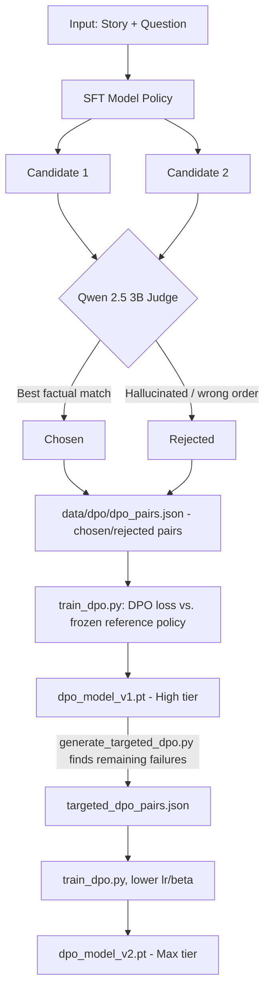

# Part 2 — Training Guide

_Part of the full documentation for [nanoGPT](https://github.com/yogeshsikhwal77/nanoGPT). See also: [Part 1 — Architecture & Pipeline](01-architecture-and-pipeline.md) · [Part 3 — Serving & Reference](03-serving-and-reference.md)._

All commands below are the **actual CLI accepted by the scripts in this repo** (verified against their `argparse` definitions), not idealized examples — including a few rough edges called out inline so you don't lose time to them.

## Contents

* [Setup](#setup)
* [Configuration Reference](#configuration-reference)
* [Phase 1: Download Data](#phase-1-download-data)
* [Phase 2: Tokenizer](#phase-2-tokenizer)
* [Phase 3: Base Pre-training](#phase-3-base-pre-training)
* [Phase 4: Hybrid SFT Data Generation](#phase-4-hybrid-sft-data-generation)
* [Phase 5: Supervised Fine-Tuning (Medium tier)](#phase-5-supervised-fine-tuning-medium-tier)
* [Phase 6: DPO Data Generation](#phase-6-dpo-data-generation)
* [Phase 7: DPO Alignment (High & Max tiers)](#phase-7-dpo-alignment-high--max-tiers)
* [Phase 8: Evaluation](#phase-8-evaluation)
* [Phase 9: Ad-hoc Generation Scripts](#phase-9-ad-hoc-generation-scripts)
* [Makefile Shortcuts](#makefile-shortcuts)
* [Direct Preference Optimization, In Detail](#direct-preference-optimization-in-detail)
* [Prompt Format](#prompt-format)

---

## Setup

### Prerequisites

* Python 3.10+
* **Git LFS** (`git lfs install`) — the `checkpoints/*.pt` files are LFS objects; without it you'll only get small pointer files
* An NVIDIA GPU with Ampere/Ada Lovelace architecture for bfloat16 (e.g. RTX 3050+, RTX 4050+) — training only; serving runs fine on CPU
* [Ollama](https://ollama.com) installed and on your system path, for the data-generation phases

### Install

```bash
git lfs install
git clone https://github.com/yogeshsikhwal77/nanoGPT.git
cd nanoGPT

python -m venv .venv
source .venv/bin/activate          # Windows: .venv\Scripts\Activate.ps1

# CUDA build of torch for training (the repo's own requirements.txt installs CPU-only torch,
# which is what the deployed service uses — swap it out for training):
pip install torch --index-url https://download.pytorch.org/whl/cu121
pip install -r requirements.txt
pip install -e .

# Not declared in requirements.txt / pyproject.toml but required for data generation:
pip install datasets ollama

ollama pull qwen2.5:3b
```

Verify GPU visibility:

```bash
python -c "import torch; print('CUDA Available:', torch.cuda.is_available(), '| Device:', torch.cuda.get_device_name(0), '| BF16 Supported:', torch.cuda.is_bf16_supported())"
```

> **Note:** `pyproject.toml` declares `torch, tokenizers, pyyaml, fastapi, uvicorn, tqdm` as dependencies, and the root `requirements.txt` (used by `Dockerfile`, i.e. production) installs `numpy, fastapi, uvicorn, tokenizers, pydantic` against the **CPU** PyTorch index. Neither file lists `datasets` or `ollama` (the Python client), even though `scripts/download_data.py`, `judge.py`, `judge1.py`, `judge_dpo.py`, and `generate_targeted_dpo.py` all import them — install them manually as shown above.

---

## Configuration Reference

### `configs/base.yaml` — read unconditionally by `train_base.py`

```yaml
model:
  dim: 512          # widened residual stream (was 384)
  layers: 8         # deeper reasoning capacity (was 6)
  heads: 8          # 512 / 8 = 64 head dim
  context_len: 512  # can handle longer, richer stories (was 256)
  vocab_size: 10000

train:
  batch_size: 16
  grad_accum: 4     # effective batch = 64
  lr: 8.0e-4
  epochs: 4         # 4 passes over the data (~50-60 min on an RTX 4050)
  seed: 42
  data_dir: data/tokenized/
  save_path: checkpoints/base_model_33M.pt
```

**Important:** `train_base.py` calls `load_base_config("configs/base.yaml")` with a hardcoded path — it does not accept a `--config` flag (the Makefile's `train` target passes one, but the script silently ignores it). **To train Fiko (15M), you must edit `configs/base.yaml` in place** (or back it up, swap in a smaller-dims version, train, then restore it) — there is no `base_15M.yaml` shipped in this repo. A Fiko-sized `model:` block matching the numbers in [Part 1](01-architecture-and-pipeline.md#architecture) would be `dim: 384, layers: 6, heads: 6, context_len: 256`, with `save_path: checkpoints/base_model_15M.pt`.

### `configs/sft_33M.yaml`

```yaml
model_path: "checkpoints/base_model_33M.pt"
data_path: "data/sft/merged_pairs.json"
save_path: "checkpoints/sft_model_33M.pt"
batch_size: 8
grad_accum: 2        # effective batch = 16
lr: 1.5e-4           # slightly gentler for fine-tuning
warmup_steps: 30     # ~10% of total steps
epochs: 2            # 2 epochs is the sweet spot to prevent memorization
min_lr_ratio: 0.1
```

### `configs/sft_15M.yaml`

```yaml
model_path: checkpoints/base_model_15M.pt
data_path: data/sft/aligned_pairs_1000.json   # note: NOT merged_pairs.json — see caveat below
save_path: checkpoints/sft_model_15M.pt
batch_size: 8
grad_accum: 2
lr: 2.0e-4
epochs: 2
warmup_steps: 50
```

Unlike `sft_33M.yaml`, the shipped `sft_15M.yaml` points at `data/sft/aligned_pairs_1000.json` (the multi-question set alone) rather than the merged single+multi dataset — repoint it at `data/sft/merged_pairs.json` if you want Fiko trained on the same hybrid data as Fire.

### DPO parameters — CLI flags, not a YAML file

`train_dpo.py` takes all of its hyperparameters as CLI flags (`--epochs`, `--batch-size`, `--grad-accum`, `--lr`, `--beta`); there is no `dpo.yaml` in this repo. See [Phase 7](#phase-7-dpo-alignment-high--max-tiers) for the exact values used in the recorded run.

---

## Phase 1: Download Data

```bash
python scripts/download_data.py
```

Downloads the first 300,000 rows of `roneneldan/TinyStories` to `data/raw/train.txt` (pre-training corpus), and `roneneldan/TinyStories-Instruct` to `data/raw/TinyStories-Instruct.json` (seed material for the SFT judges). Requires the `datasets` package.

## Phase 2: Tokenizer

```bash
# Train the 10k-vocab byte-level BPE tokenizer
python -m nanogpt.tokenizers train --vocab-size 10000 --data-path data/raw

# Encode the raw text into memory-mapped uint16 shards
python -m nanogpt.tokenizers encode --input-dir data/raw/ --output-dir data/tokenized/
```

Produces `tokenizer.json` and `data/tokenized/shard_0000.bin`.

## Phase 3: Base Pre-training

```bash
# Fire (33M) — configs/base.yaml as shipped
python -m nanogpt.train_base

# Fiko (15M) — edit configs/base.yaml first (dim:384, layers:6, heads:6, context_len:256,
# save_path: checkpoints/base_model_15M.pt), then run the same command
python -m nanogpt.train_base
```

Trains with a cosine LR schedule, checkpoints only on a new best validation loss, and prints elapsed time every 50 steps.

## Phase 4: Hybrid SFT Data Generation

```bash
# 1. Single-question pairs
python -m nanogpt.judge --instruct-data data/raw/TinyStories-Instruct.json --output data/sft/aligned_pairs.json --max-samples 500

# 2. Multi-question pairs — MUST override --output, since judge1.py's default
#    ("data/sft/aligned_pairs.json") is the same as judge.py's and would overwrite it
python -m nanogpt.judge1 --instruct-data data/raw/TinyStories-Instruct.json --output data/sft/aligned_pairs_1000.json --max-samples 500

# 3. Merge — no CLI args; hardcoded to read exactly
#    data/sft/aligned_pairs.json + data/sft/aligned_pairs_1000.json
python -m nanogpt.merge_data
```

`judge.py` and `judge1.py` also accept `--model-path` and `--candidates` flags, but both are explicitly ignored by the current implementation (`help="Ignored"` in their own `argparse` definitions) — don't rely on them. Output: `data/sft/merged_pairs.json`.

## Phase 5: Supervised Fine-Tuning (Medium tier)

```bash
# Fire (33M)
python -m nanogpt.train_sft --config configs/sft_33M.yaml

# Fiko (15M)
python -m nanogpt.train_sft --config configs/sft_15M.yaml
```

Optional flags: `--val-fraction` (default `0.05`) and `--eval-every` (optimizer steps between validation passes, default `100`). Loss is computed only on answer tokens (masked with `-100` on the story/question span).

## Phase 6: DPO Data Generation

```bash
# 1. Generate candidate answers from the SFT checkpoint and have Qwen grade chosen/rejected
python -m nanogpt.judge_dpo \
  --sft-checkpoint checkpoints/sft_model_33M.pt \
  --seed-data data/sft/aligned_pairs.json \
  --output data/dpo/dpo_pairs.json \
  --max-pairs 500
```

This is the pass used for baseline DPO (v1). The targeted, harder dataset for v2 is mined **after** v1 exists — see the next phase.

## Phase 7: DPO Alignment (High & Max tiers)

```bash
# Fire — High tier: baseline DPO (v1)
python -m nanogpt.train_dpo \
  --sft-checkpoint checkpoints/sft_model_33M.pt \
  --dpo-data data/dpo/dpo_pairs.json \
  --save-path checkpoints/dpo_model_33M_v1.pt \
  --epochs 1 --batch-size 2 --grad-accum 4 --lr 2e-6 --beta 0.1

# Mine targeted chronology/list-extraction failures from the v1 checkpoint
# (override --model-path — its default, checkpoints/dpo_model_33M.pt, doesn't match any
# file this pipeline actually produces)
python -m nanogpt.generate_targeted_dpo \
  --model-path checkpoints/dpo_model_33M_v1.pt \
  --seed-data data/sft/aligned_pairs.json \
  --output data/dpo/targeted_dpo_pairs.json \
  --max-stories 100

# Fire — Max tier: targeted DPO (v2), gentler lr/beta than v1
python -m nanogpt.train_dpo \
  --sft-checkpoint checkpoints/dpo_model_33M_v1.pt \
  --dpo-data data/dpo/targeted_dpo_pairs.json \
  --save-path checkpoints/dpo_model_33M_v2.pt \
  --epochs 1 --batch-size 2 --grad-accum 4 --lr 1e-6 --beta 0.08
```

Repeat the same three commands with `_15M` in place of `_33M` (and `sft_model_15M.pt` as the SFT checkpoint) to produce Fiko's High and Max checkpoints — `checkpoints/dpo_model_15M_v2.pt` is required for the `fiko-max` engine to load in `app/main.py` (see [Part 3](03-serving-and-reference.md)).

## Phase 8: Evaluation

```bash
python -m nanogpt.evaluate --checkpoint checkpoints/dpo_model_33M_v2.pt \
  --data-dir data/tokenized --tokenizer-path tokenizer.json \
  --batch-size 16 --iters 50
```

Reports validation loss, perplexity, and generation latency.

## Phase 9: Ad-hoc Generation Scripts

Two standalone (non-`-m`) scripts exist for quick manual checks:

```bash
python sample.py      # unconditional generation from checkpoints/base_model_33M.pt
python test_cot.py    # Answer-Prefix-Priming demo — story is hardcoded in the script
```

**Heads up:** `test_cot.py` hardcodes `checkpoints/dpo_model_33M.pt` (no `_v1`/`_v2` suffix), which this pipeline never actually produces — copy/rename a checkpoint to that exact filename, or edit the path in the script, before running it.

`test_cot.py`'s "Answer Prefix Priming" idea — steering the model's attention past common logic traps by priming the start of the answer span — has since been generalized and moved **into the live server itself**: `app/main.py`'s `get_dynamic_prefix()` applies equivalent heuristics (for "what two…", "why…", "when…", "where did X go", "what did X do after/before Y…") to every `/chat` request, not just this offline demo. See [Part 3](03-serving-and-reference.md).

---

## Makefile Shortcuts

```bash
make setup     # CUDA torch + requirements.txt + editable install + `ollama pull llama3.2:1b`
make tokenize  # python -m nanogpt.tokenizers encode --input-dir data/raw/ --output-dir data/tokenized/
make train     # python -m nanogpt.train_base --config configs/base.yaml (the --config flag is ignored, see above)
make judge     # python -m nanogpt.judge --model-path checkpoints/base_model_15M.pt --instruct-data data/raw/TinyStories-Instruct.json --output data/sft/aligned_pairs.json --candidates 3
make sft       # python -m nanogpt.train_sft --config configs/sft.yaml  (configs/sft.yaml doesn't exist — pass configs/sft_33M.yaml or sft_15M.yaml explicitly instead)
make serve     # uvicorn app.main:app --host 127.0.0.1 --port 8000
make test      # pytest -q
```

Two things to know before relying on `make`: `make setup` pulls `llama3.2:1b` via Ollama, but every judge/DPO script in `src/nanogpt/` is hardcoded to call `qwen2.5:3b` — pull that model instead (`ollama pull qwen2.5:3b`). And `make sft` points at `configs/sft.yaml`, which isn't in the repo — use `make`'s command as a template but pass `--config configs/sft_33M.yaml` (or `sft_15M.yaml`) yourself. There are no Makefile targets for the DPO phases; use the `python -m nanogpt.judge_dpo` / `train_dpo` / `generate_targeted_dpo` commands above directly.

---

## Direct Preference Optimization, In Detail



**Why DPO instead of RLHF with PPO?** DPO reformulates preference alignment as a single classification-style loss between a policy and a frozen reference model, using only chosen/rejected pairs — no separate reward model or on-policy rollouts to stabilize. That's dramatically cheaper to implement and run, which matters when the whole loop needs to fit inside 6 GB of VRAM. `train_dpo.py` loads the same checkpoint twice — once as the trainable policy, once frozen (`requires_grad=False`) as the reference — so the added memory cost over plain SFT is one extra forward pass, not a second trainable model.

**Why a targeted v2 set?** After the first DPO pass, the most persistent errors cluster around a few specific patterns — chronological ordering ("what happened first?") and multi-item list extraction ("what two things did she bring?"). `generate_targeted_dpo.py` searches the v1 checkpoint's outputs for these failure modes and builds a second, harder preference dataset focused on fixing them, trained with a lower learning rate and beta for a gentler correction (see the [recorded run](01-architecture-and-pipeline.md#a-recorded-training-run), where the v2 pass's loss moved measurably more than v1's did).

---

## Prompt Format

SFT and inference both use strict special-token boundaries:

```text
<|story|> {story} <|question|> {question} <|answer|> {answer} <|eos|>
```

DPO preference pairs share the same story/question prefix with two candidate continuations:

```text
Prompt:    <|story|> {story} <|question|> {question} <|answer|>
Chosen:    {factually correct answer} <|eos|>
Rejected:  {hallucinated or order-confused answer} <|eos|>
```

At inference, input stops at `<|answer|>` and generation samples tokens autoregressively until `<|eos|>` or `max_tokens` is reached. Inputs longer than the model's context window are truncated **from the start of the story**, preserving the entire question.